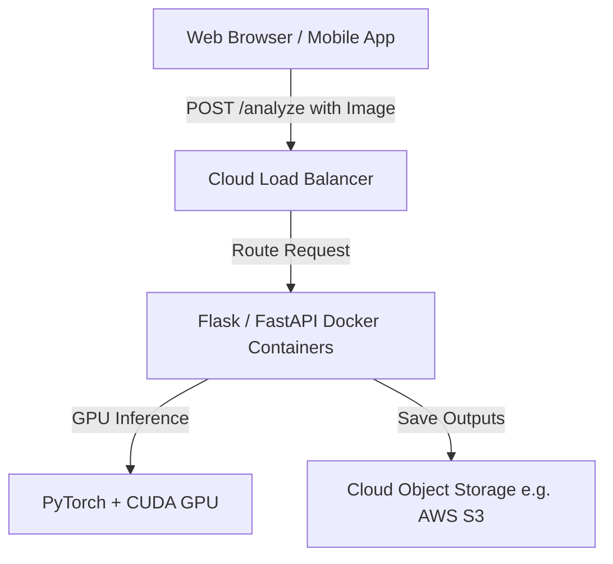

# Cloud Deployment Guide (Global Cloud Computing)

Yes, the trained YOLOv8 and SAM 2 model pipeline can be deployed globally to run as a cloud computing service. This allows users to access the analyzer via a public URL, mobile app, or API without needing a local GPU.

This guide outlines the architecture, containerization (`Dockerfile`), and cloud options for deploying this project.

---

## 1. Cloud Architecture Overview

To scale globally, the pipeline is usually split into a **Frontend Client** (browser/mobile) and a **Backend API** (GPU-accelerated endpoint).



*   **API Endpoint:** The backend runs the Python Flask app (or FastAPI for high performance) inside Docker containers.
*   **Object Storage (AWS S3, GCP Cloud Storage):** Raw uploads and annotated results are stored on persistent object storage rather than local disk.
*   **Production Server:** Replace Flask's built-in development server with a production WSGI server like **Gunicorn** or **Uvicorn** using multiple worker processes.

---

## 2. Docker Containerization (`Dockerfile`)

To run PyTorch, CUDA, YOLOv8, and SAM 2 on the cloud without environment version mismatches, containerization is mandatory. 

Below is the `Dockerfile` configured with NVIDIA CUDA libraries:

```dockerfile
# Use official PyTorch base image with CUDA support
FROM pytorch/pytorch:2.1.2-cuda12.1-cudnn8-runtime

# Set environment variables
ENV PYTHONUNBUFFERED=1 \
    DEBIAN_FRONTEND=noninteractive

WORKDIR /app

# Install system dependencies for OpenCV and Git (to download SAM 2)
RUN apt-get update && apt-get install -y --no-install-recommends \
    build-essential \
    git \
    ffmpeg \
    libsm6 \
    libxext6 \
    libxrender-dev \
    libgl1-mesa-glx \
    && rm -rf /var/lib/apt/lists/*

# Copy requirements and install python packages
COPY requirements.txt .
RUN pip install --no-cache-dir -r requirements.txt

# Install SAM 2 directly from GitHub source
RUN pip install --no-cache-dir "git+https://github.com/facebookresearch/sam2.git"

# Copy the rest of the application
COPY . .

# Download the SAM 2 weights if they do not exist
RUN python scripts/download_sam2.py

# Expose port
EXPOSE 5000

# Run with Gunicorn production server (using 2 workers)
CMD ["gunicorn", "--bind", "0.0.0.0:5000", "--workers", "2", "--timeout", "120", "website.app:app"]
```

---

## 3. Cloud Deployment Options

Depending on your budget and traffic patterns, there are three primary deployment paths:

### Option A: Serverless GPU (Most Cost-Effective for Low/Variable Traffic)
Instead of renting a GPU 24/7, you deploy the Docker container to a serverless platform that bills you *only for the exact milliseconds* your code runs. When idle, the cost is $0.
*   **Recommended Providers:** RunPod Serverless, Replicate, Modal, or Banana.dev.
*   **How it works:** They spin up a GPU container instantly when an image upload occurs, run the inference, and shut it down.

### Option B: Dedicated GPU Instance (Best for Consistent/High Traffic)
Rent a persistent virtual machine equipped with an NVIDIA GPU.
*   **Recommended Providers:**
    *   *Low Cost:* RunPod (Community GPU instances like RTX 3060/4090 are ~$0.20 - $0.40/hour).
    *   *Enterprise:* AWS EC2 (`g4dn.xlarge` instance equipped with an NVIDIA T4 GPU) or GCP Compute Engine.
*   **How to Deploy:** Run Docker Compose directly on the VM instance and point a domain name to its public IP address.

### Option C: CPU-Only Cloud Instance (Lowest Cost, Slow Inference)
If you only need a low-cost staging environment and don't mind slower response times, you can run the backend on a CPU-only server (e.g. AWS EC2 t3.medium, DigitalOcean Droplet, Heroku, Render).
*   **Cost:** ~$5 to $15 per month.
*   **Note:** The system will automatically degrade gracefully to OpenCV Otsu-segmentation fallback (fast) or compute SAM 2 on the CPU (slow, ~10s per image).
