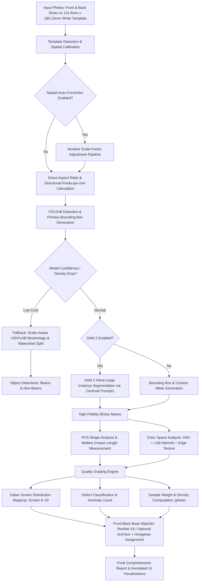

# Technical Synopsis: Coffee Bean Inspection & Analysis Platform

## 1. Process Flow Chart

---

## 2. Step-by-Step Data Processing, Transformation & Analysis Logic

### Step 1: Preprocessing & Physical Spatial Calibration
1. **White Template Auto-Cropping**: Locates the white calibration background ($113.4\text{ mm} \times 180.13\text{ mm}$) using adaptive thresholding (`THRESH_BINARY > 180`) and contour aspect ratio validation ($1.1 \le \text{AR} \le 1.7$).
2. **Directional Calibration**: Derives separate horizontal ($px\_per\_mm\_x$) and vertical ($px\_per\_mm\_y$) pixel-to-millimeter ratios to account for camera tilt/perspective distortion.
3. **Spatial Coordinates Correction**: In pipeline mode, performs iterative proportional feedback adjustments ($\text{scale\_factor} \times \frac{\text{target\_len}}{\text{avg\_len}}$) to force measurements within exact standard physical thresholds.

### Step 2: Detection & Segmentation Layer
1. **YOLOv8 Object Detection**: Extracts initial bounding boxes and defect class confidences.
2. **Contour/Watershed Fallback**: If YOLOv8 confidence drops below threshold or produces oversized bounding boxes, runs local contrast subtraction (`GaussianBlur` background subtraction), LAB warmth mask (`a* + b*`), and `cv2.watershed` to separate touching/clustered beans.
3. **SAM 2 High-Fidelity Segmentation**: Uses SAM 2.1 (Hiera Large) with centroid point prompting ($cx = \frac{x1+x2}{2}, cy = \frac{y1+y2}{2}$) in FP16 batched inference (`SAM_CHUNK_SIZE = 64`) to extract sub-pixel precision instance masks.

### Step 3: Transformation & Fine Shape/Color Analysis
1. **PCA Orientation & Alignment**: Runs Principal Component Analysis (`cv2.PCACompute`) on the binary mask contour to find the primary axis angle. Rotates the bean mask so the major axis is horizontal.
2. **Midline Crease Measurement**: Samples vertical slices along the horizontal major axis to trace the central midline curve. Calculates:
   - **Midline Length ($\text{mm}$)**: Perpendicular deviation-compensated length along the main crease (avoids over-estimating curved/banana-shaped beans).
   - **Curvature Angle ($^\circ$) & Symmetry Score ($0.0-1.0$)**: Categorizes bean profiles into `STRAIGHT`, `SLIGHTLY_CURVED`, `CURVED`, or `IRREGULAR`.
3. **Color & Non-Bean Classification**: Converts ROI into HSV & LAB color spaces. Measures `gray_std`, LAB warmth score ($L + a + b$), and Canny edge density to segregate non-bean matter from coffee beans.

### Step 4: Quality Grading & Aggregation
1. **Screen Distribution**: Maps each bean's physical length/aperture against Indian Standard sieve sizes (Screens 8 to 20; $3.18\text{ mm}$ to $7.94\text{ mm}$).
2. **Quality Grade Assignment**: Computes the sample average length and assigns overall grades: **AAA** ($\ge 7.54\text{mm}$ / Screen 19+), **AA**, **A**, **B**, **C**, **BB**, **PB**, or **Triage**.
3. **Density Calculation**: $\text{Density (g/bean)} = \frac{\text{Sample Weight (g)}}{\text{Bean Count}}$.

### Step 5: Dual-Image Front-Back Matching (ArcFace-Ready)
1. Crops individual detected beans from front and back photographs.
2. Passes crops through an embedding backbone (ResNet-18 by default; optional trained ArcFace model) to generate normalized 512-dimensional feature vectors.
3. Computes a pairwise cosine similarity matrix.
4. Solves global optimal 1-to-1 matching via the **Hungarian Algorithm** (`scipy.optimize.linear_sum_assignment`).

---

## 3. Input & Output Correlation

| Input Parameters | Processing Module | Output Data / Metrics |
| :--- | :--- | :--- |
| **Front Image** (RGB) | YOLOv8 + SAM 2 + PCA Shape Analyzer | • Total Bean Count & Non-Bean Count • Average Bean Length, Width ($\text{mm}$), L/W Ratio • Size Class Distribution (Very Small to Very Large) |
| **Back Image** (RGB, optional) | ArcFace-Ready Feature Extraction + Hungarian Assignment | • 1:1 Front-to-Back Bean Pairings • Matched crop export for training |
| **Sample Weight** (default 350g) | Density Calculator | • Average Weight per Bean ($\text{g/bean}$) |
| **White Calibration Plate** ($113.4 \times 180.13\text{ mm}$) | ObjectDetector Calibration | • Calibrated `pixels_per_mm` (X & Y axes) • Perspective Correction Factor |
| **Model Defect Detections** | `src/grading.py` | • Defect Breakdown by anomaly type • Defect Count & Percentage |
| **Screen Tables** (Indian Standard) | `compute_screen_distribution()` | • Screen 8–20 Breakdown (Count & %) • Quality Grade: **AAA, AA, A, B, C, BB, PB, Triage** |

---

## 4. AI Model Architecture & Training Setup

### A. Core Models Architecture
1. **Detection Model**: **YOLOv8 Nano (`YOLOv8n`)**
   - **Type**: Single-stage anchor-free object detection CNN.
   - **Structure**: Cross Stage Partial backbone (C2f), Spatial Pyramid Pooling Fast (SPPF) head.
2. **Segmentation Model**: **SAM 2.1 Hiera Large (`sam2.1_hiera_large.pt`)**
   - **Type**: Transformer-backed Foundation Model for high-fidelity zero-shot mask generation.
   - **Optimization**: PyTorch SDPA (Flash-Attention & Memory-Efficient SDP) with FP16 Autocast.
3. **Embedding Model**: **ResNet-18 Backbone with optional ArcFace model**
   - **Type**: Residual Neural Network used as the default feature extractor, with a swappable trained ArcFace embedding model.

### B. Preprocessing & Data Pipeline
- **Contrast Enhancement**: CLAHE (Contrast Limited Adaptive Histogram Equalization) on grayscale ROIs.
- **Morphology**: Gaussian blurring, Otsu thresholding, distance transform, erosion/dilation.
- **Normalisation**: PyTorch ImageNet normalization ($\mu = [0.485, 0.456, 0.406]$, $\sigma = [0.229, 0.224, 0.225]$) resized to $112 \times 112$ for ArcFace crops.

### C. Training Setup & Performance
- **Dataset**: 5,505 annotated images across key defect categories.
- **Hyperparameters**: 150 epochs, batch size 16.
- **Metrics Achieved**:
  - **mAP50**: `0.967`
  - **mAP50-95**: `0.756`
  - **Precision**: `90.1%`
  - **Recall**: `0.942`

---

## 5. Key Enhancements Over Existing Solutions

1. **Midline Crease vs Bounding Box Measurement**: Conventional CV systems rely on rectangular bounding boxes or minimum bounding rectangles, which overestimate curved coffee bean sizes. This system extracts the actual midline crease via PCA alignment, matching physical sieve retention closely.
2. **Centroid-Prompted SAM 2 Batching**: Integrates SAM 2 using centroid prompts in 64-box chunks, preventing GPU Out-Of-Memory (OOM) errors on consumer hardware while delivering sub-pixel boundary accuracy.
3. **Automatic Spatial Coordinates Correction**: Includes a dedicated auto-calibration loop (`pipeline.py`) that adjusts scale factors based on background template detection, ensuring standard physical grade conformity across varying camera heights and angles.
4. **ArcFace-Ready Front-Back Bean Matching**: Uses feature embeddings combined with Hungarian assignment to pair front and back crops; a trained ArcFace model can be swapped in later for higher-fidelity matching.
5. **Hybrid AI + CV Fallback System**: Prevents pipeline failure on unusual lighting or high-density bean overlap by gracefully falling back from YOLOv8 to scale-aware HSV/LAB morphology and watershed segmentation.

